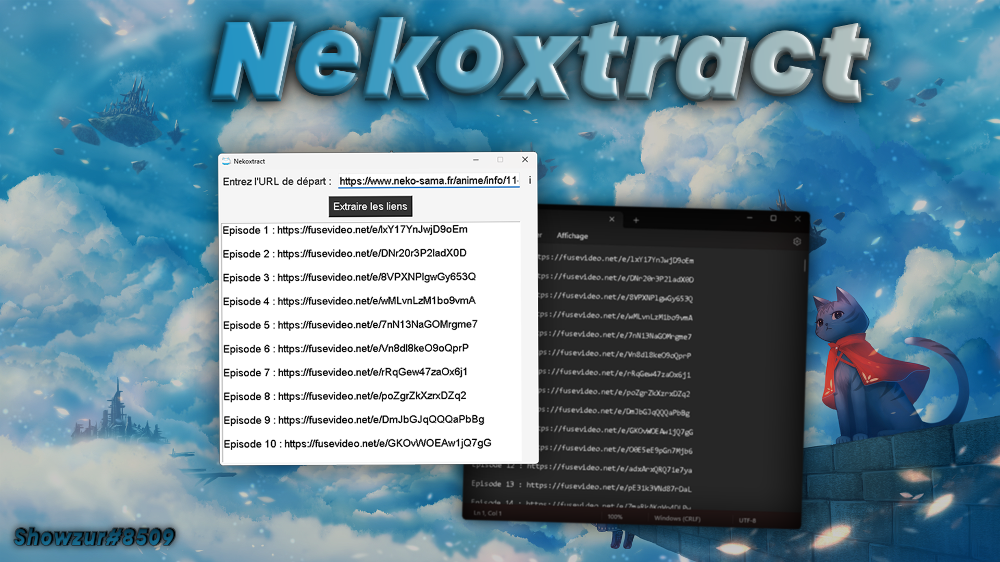

<h1 align="center">Nekoxtract </h1>

> 🪝 Here is a program that retrieves streaming links from the laranime.tv website.

##  👇 Downloads

 

## 🚀 Usage - Exe Method

**First Step :** Simply click on the vc_redist.x64.exe file

**Second Step :** Simply click on the Nekoxtract.exe file  
Then go to the site neko-sama.fr to find the anime you want like this example  [https://www.neko-sama.fr/anime/info/11-naruto_vostfr] then see the result for yourself.

## 🚀 Usage - Python Method

**First Step :** Simply click on the Install.bat file

**Second Step :** Simply click on the Start.bat file  

## 👤 Author

**Showzur**

* SRV Discord: [Shynonime](https://discord.gg/UHy8mZsNh8)
* Twitter: [@Showzur](https://twitter.com/Showzur)
* Github: [@shwzr](https://github.com/shwzr)

## Show your support

Give a ⭐️ if this project helped you!

## 📝 License

Copyright © 2023 [Showzur](https://github.com/shwzr). 

***
